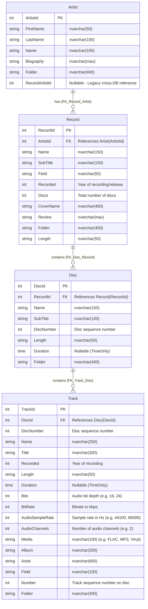

# MusicDBRazor 🎵

A full-featured, responsive **ASP.NET Core 10.0 Razor Pages** web application engineered with a clean, decoupled Data Access Layer (DAL) using **Entity Framework Core 10** and a comprehensive **xUnit** test suite. The application manages, explores, and analyzes a rich hierarchical music catalog spanning artists, records (albums), multi-disc sets, and audio tracks.

---

## 📑 Table of Contents
1. [Overview & Features](#-overview--features)
2. [Project Architecture & Solution Structure](#-project-architecture--solution-structure)
3. [Technology Stack & Dependencies](#-technology-stack--dependencies)
4. [SQL Server Database Schema & Relationships](#-sql-server-database-schema--relationships)
5. [Stored Procedures & Repository Layer](#-stored-procedures--repository-layer)
6. [Test Suite (`MusicDB.Tests`)](#-test-suite-musicdbtests)
7. [Getting Started & Configuration](#-getting-started--configuration)
8. [EF Core Scaffolding Guide](#-ef-core-scaffolding-guide)

---

## 🌟 Overview & Features

`MusicDBRazor` provides a user-friendly and responsive interface for music collectors and audiophiles:
* **Catalog Management (CRUD):** Full Create, Read, Update, and Delete operations for Artists, Records, Discs, and Tracks.
* **Smart Search & Filtering:** Dynamic search across artists, album titles, recorded years (e.g., `1977`), genres, and partial track name matches.
* **Custom Pagination:** Efficient server-side and in-memory pagination with custom sliding-window UI controls (up to 15 dynamic page jump buttons).
* **Music Diagnostics & Statistics:**
  * **Artist Totals:** Aggregated album and track metrics per artist.
  * **Single-Track Albums:** Identification of stand-alone releases or single-track media.
  * **Guest Artist Appearances:** Tracking collaborative tracks where artists perform as guests.
  * **Faulty Tag Detection:** Spotting metadata tagging inconsistencies (e.g., invalid genre/field tags).
  * **Playtime Analysis:** Calculation of total recorded playtime and disc runtimes.
* **Playlist Support:** Integrated parsing and playlist generation via `PlaylistsNET`.
* **Mobile-First Responsive Design:** Adaptive card views, responsive tables, and custom CSS gradients optimized across mobile, tablet, and desktop screens.

---

## 🏗️ Project Architecture & Solution Structure

The solution follows a multi-project, modular architecture separating the presentation, business/data access layer, and automated tests:

```text
MusicDBRazor/
│
├── MusicDB/                        # Web Presentation Layer (ASP.NET Core Razor Pages)
│   ├── Pages/
│   │   ├── Artists/                # Artist views, CRUD, and search pages
│   │   ├── Records/                # Record/Album views, year search, and tagging
│   │   ├── Discs/                  # Disc views and disc number listings
│   │   ├── Tracks/                 # Track listings, single-track analysis, guest artist tracks
│   │   ├── Statistics/             # Aggregate reporting (Artist totals, runtimes)
│   │   └── Shared/                 # Layouts, navigation, and validation scripts
│   ├── wwwroot/                    # Static assets (CSS, JS, images, icons)
│   ├── Program.cs                  # Dependency Injection & middleware pipeline
│   └── appsettings.json            # Configuration & Connection Strings
│
├── MusicDB.Data/                   # Data Access Layer (Class Library)
│   ├── Entities/                   # Scaffolded EF Core POCO Entities (Artist, Record, Disc, Track)
│   ├── Models/                     # DTOs & Stored Procedure result models
│   ├── Repositories/               # Repository implementations (IArtistRepository, etc.)
│   └── MusicDbContext.cs           # EF Core DbContext with Fluent API mappings
│
├── MusicDB.Tests/                  # Automated Test Suite (xUnit Test Project)
│   ├── Entities/                   # Entity model & relationship unit tests
│   ├── Pages/                      # Razor PageModel business logic & pagination unit tests
│   ├── Integration/                # WebApplicationFactory end-to-end routing tests
│   └── Helpers/                    # In-memory DbContext test factories
│
└── MusicDBRazor.slnx               # Modern XML-based Solution file
```

---

## 🛠️ Technology Stack & Dependencies

### Core Frameworks & Runtime
* **.NET 10.0 SDK** (C# 14 with `<Nullable>enable</Nullable>` and implicit usings)
* **ASP.NET Core 10.0 Razor Pages**

### Data Access & ORM
* **Entity Framework Core 10.0.9**
  * `Microsoft.EntityFrameworkCore.SqlServer` — SQL Server database provider
  * `Microsoft.EntityFrameworkCore.Design` & `Tools` — Migrations and scaffolding tooling

### Audio & Playlist Utilities
* **PlaylistsNET (1.4.1)** — M3U/WPL playlist generation and parsing
* **NuGet.Protocol & NuGet.Packaging (7.6.0)** — Package metadata utilities

### Frontend & Styling
* **Bootstrap 5.x** — Core layout grid and UI utility classes
* **Custom Responsive CSS** — Tailored gradient branding, glassmorphism cards, responsive typography, and customized pagination controls

### Testing Frameworks
* **xUnit (2.9.3)** & **Microsoft.NET.Test.Sdk (17.14.1)**
* **FluentAssertions (8.10.0)** — Expressive assertion framework
* **Moq (4.20.72)** — Mocking library
* **Microsoft.EntityFrameworkCore.InMemory (10.0.9)** — In-memory DB testing
* **Microsoft.AspNetCore.Mvc.Testing (10.0.11)** — In-memory test server (`WebApplicationFactory`)

---

## 🗄️ SQL Server Database Schema & Relationships

The database is built on SQL Server with collation `SQL_Latin1_General_CP1_CI_AS`. It implements a strictly enforced 4-tier hierarchical schema:



---

## ⚡ Stored Procedures & Repository Layer

To support high-performance analytical queries and complex statistics without overloading client-side LINQ execution, `MusicDB.Data` implements dedicated repository interfaces:

| Interface | Method | Stored Procedure / Query | Purpose |
| :--- | :--- | :--- | :--- |
| `IArtistRepository` | `GetArtistTotalsAsync` | `EXEC adm_GetArtistTotals` | Aggregates album count, disc count, track count, and duration per artist. |
| `IRecordRepository` | `GetFaultyFieldAlbumsAsync` | `EXEC up_GetFaultyFieldAlbums` | Detects album records with invalid or missing genre/field classification tags. |
| `ITrackRepository` | `GetSingleTrackAlbumsAsync` | `EXEC adm_GetAlbumsWithOneTrack` | Identifies all records containing only a single track. |
| `ITrackRepository` | `GetGetBriefTrackListByYearAsync` | `EXEC up_GetBriefTrackListByYear` | Generates a summarized track listing for releases in a specific year. |
| `ITrackRepository` | `GetGuestArtistTracksAsync` | `EXEC adm_GetArtistGuestTracks` | Queries tracks featuring guest collaborations for a selected artist. |
| `ITrackRepository` | `GetTracksByNameAsync` | LINQ Query on `Track.Name` | Performs partial-match track name searches with server-side pagination. |
| `IStatisticsRepository` | `GetTotalAlbumTimeAsync` | Stored Procedure / Dynamic query | Computes overall playtime across the entire music collection. |

All repository implementations utilize parameterized SQL / `SqlParameter` or EF Core's type-safe `SqlQuery<T>()` API to prevent SQL injection vulnerabilities.

---

## 🧪 Test Suite (`MusicDB.Tests`)

`MusicDB.Tests` is an isolated test project adhering to .NET testing best practices. It tests entity integrity, business logic in PageModels, and HTTP endpoint routing without requiring a live SQL Server instance.

### Test Categories

1. **Entity Unit Tests (`Entities/`):**
   * [`ArtistEntityTests.cs`](file:///d:/Projects/MusicDBRazor/MusicDB.Tests/Entities/ArtistEntityTests.cs): Verifies default initialization, property mutation, and child `Record` collection tracking.
   * [`RecordEntityTests.cs`](file:///d:/Projects/MusicDBRazor/MusicDB.Tests/Entities/RecordEntityTests.cs): Validates navigation properties and `Disc` association.

2. **PageModel Unit Tests (`Pages/`):**
   * [`ArtistsIndexModelTests.cs`](file:///d:/Projects/MusicDBRazor/MusicDB.Tests/Pages/ArtistsIndexModelTests.cs):
     * Tests `OnGetAsync` default paged retrieval.
     * Tests name search filtering (`SearchString`).
     * Tests pagination boundary clamping when requesting invalid/out-of-range page numbers.
   * [`RecordsIndexModelTests.cs`](file:///d:/Projects/MusicDBRazor/MusicDB.Tests/Pages/RecordsIndexModelTests.cs):
     * Tests year-based search parsing (e.g. `1977`).
     * Tests artist-name search matching.

3. **End-to-End Integration Tests (`Integration/`):**
   * [`RazorPagesRoutingTests.cs`](file:///d:/Projects/MusicDBRazor/MusicDB.Tests/Integration/RazorPagesRoutingTests.cs):
     * Utilizes `CustomWebApplicationFactory` to spin up the web host in memory.
     * Swaps out the SQL Server provider for an isolated EF Core `InMemoryDatabase` per test.
     * Validates that all primary Razor Pages (`/`, `/Artists`, `/Records`, `/Discs`, `/Tracks`, `/Privacy`) return `HTTP 200 OK` and valid `text/html` content.

### Running the Test Suite

Run all tests via the .NET CLI:
```powershell
dotnet test
```

Or run tests specifically targeting the test project:
```powershell
dotnet test MusicDB.Tests/MusicDB.Tests.csproj
```

---

## 🚀 Getting Started & Configuration

### 1. Prerequisites
* [.NET 10.0 SDK](https://dotnet.microsoft.com/download)
* SQL Server (LocalDB, SQL Express, or Docker container)

### 2. Configuration (`appsettings.json`)
Create an `appsettings.json` file inside the `MusicDB/` directory with your connection string:

```json
{
  "Logging": {
    "LogLevel": {
      "Default": "Information",
      "Microsoft.AspNetCore": "Warning"
    }
  },
  "AllowedHosts": "*",
  "ConnectionStrings": {
    "MusicDb": "Server=localhost,11433;Database=MusicDB;User Id=sa;Password=YOUR_PASSWORD;TrustServerCertificate=True;"
  }
}
```

### 3. Build & Run
```powershell
# Restore and build all projects in the solution
dotnet build

# Run the web application
dotnet run --project MusicDB/MusicDB.csproj
```

Once running, navigate to `https://localhost:7000` (or the port displayed in your terminal).

---

## 📂 EF Core Scaffolding Guide

If the SQL Server database schema changes or stored procedure outputs are modified, update the entity models in `MusicDB.Data` using `dotnet-ef`:

```powershell
dotnet ef dbcontext scaffold `
    "Server=localhost,11433;Database=MusicDB;User Id=sa;Password=YOUR_PASSWORD;TrustServerCertificate=True;" `
    Microsoft.EntityFrameworkCore.SqlServer `
    --project MusicDB.Data/MusicDB.Data.csproj `
    --startup-project MusicDB/MusicDB.csproj `
    --context MusicDbContext `
    --context-namespace MusicDB.Data `
    --namespace MusicDB.Data.Entities `
    --output-dir Entities `
    --context-dir . `
    --no-onconfiguring `
    --force
```
